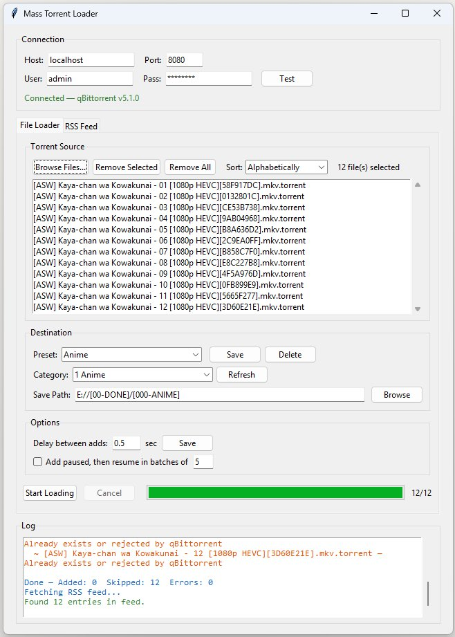
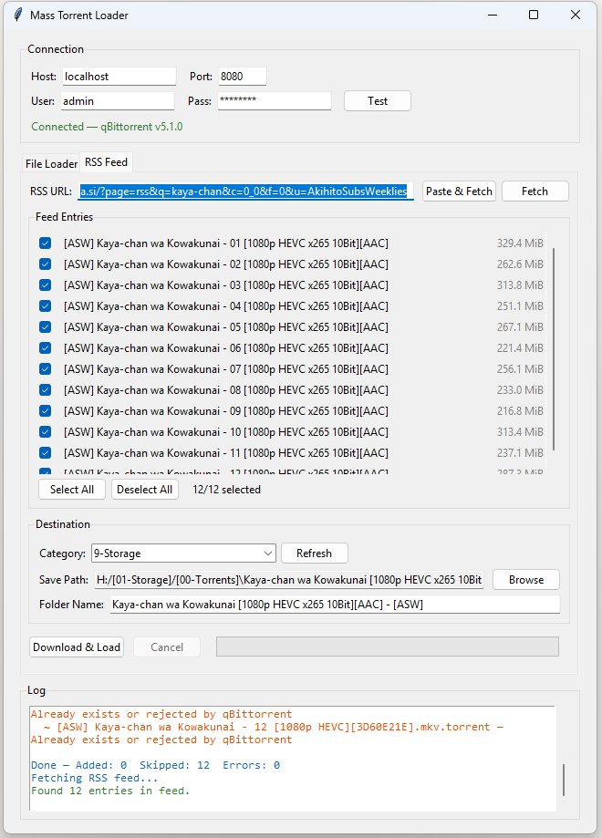

# Mass Torrent Loader

Load tons of .torrents into qBittorrent at once — precise category and folder, correct from the getgo.

<table>
  <tr>
    <td></td>
    <td></td>
  </tr>
  <tr>
    <td align="center"><b>File Loader</b> — bulk-select torrents, assign category and folder</td>
    <td align="center"><b>RSS Feed</b> — fetch a nyaa.si feed, pick episodes</td>
  </tr>
</table>

---

## The Problem

When an anime series doesn't have a batch release, you're stuck downloading every episode as a separate torrent file. Twelve episodes means twelve files to grab and load individually. It's tedious.

On top of that, you have to manually create a folder to house them — "Hell Mode S01", "Frieren S01", whatever the show is — before you can even start loading. That's an extra step every single time.

The RSS feed route isn't much better — you still end up pulling each torrent and feeding them into qBittorrent one by one.

And if you load a batch into the wrong category by mistake, you pay for it later. qBittorrent has to physically move all those files to the correct drive destination when you fix it — and with large or numerous files, that moving process can run for a long time.

The fix is simple: get everything into the right category and folder from the start, in one go, with the folder already named and created. That's what this does.

---

## What You Get

- **Load an entire season at once** — select all your .torrent files in one go, or drag them straight from Explorer into the app
- **Assign category and folder once for the whole batch** — no clicking through the same settings for every file
- **Correct from the getgo** — files land in the right place immediately, no moving process later
- **Save combinations you use often as presets** — one click to apply your usual category/folder setup for a specific type of content
- **RSS feed support** — paste a nyaa.si feed URL, get a checklist of every episode, pick what you want and add them all at once
- **Smart folder naming from RSS** — paste a nyaa.si feed, and the app reads the episode filename to build a clean folder name automatically (e.g. "Hell Mode [1080p] - [SubGroup]") — no manual folder creation needed
- **Paced loading** — a configurable delay between additions keeps qBittorrent stable on large batches

---

## How to Install

1. Make sure [qBittorrent](https://www.qbittorrent.org/) is installed and running
2. In qBittorrent: go to **Tools → Options → Web UI** and check **"Web User Interface (Remote Control)"** — note your port, username, and password
3. Double-click **`install_dependencies.bat`**
4. Double-click **`run.bat`** to launch
5. On first launch, enter your qBittorrent host, port, and credentials, then click **Test**

> Your credentials are saved locally in `config.json` and never leave your machine.

---

## How to Use

### File Loader tab

1. Click **Add Files** or drag .torrent files directly from Explorer into the list
2. Set a **Category** and **Save Path** — these apply to every file in the batch
3. Optionally save this combination as a **Preset** for next time
4. Click **Add to qBittorrent**

Files are added one at a time with a short delay between each. qBittorrent stays stable.

### RSS Feed tab

1. Paste a nyaa.si RSS URL into the feed box and click **Fetch**
2. A checklist of all entries appears — tick the ones you want
3. Set a **Category** — the save path fills in automatically from qBittorrent
4. Review the auto-generated **Folder Name** (edit if needed)
5. Click **Add Selected**

The folder is created automatically with a name derived from the episode filenames.

---

## Known Limitations & Bugs

| Limitation | Details |
|---|---|
| **qBittorrent only** | Uses the qBittorrent Web API. Deluge, Transmission, and other clients are not supported. |
| **RSS tab is nyaa.si only** | Feed parsing and smart folder naming are built for nyaa.si's format. Other RSS sources won't work correctly. |
| **Windows only** | Uses Windows-specific components for drag-and-drop and DPI handling. |
| **Paused batch mode is experimental** | Adds all torrents as paused then resumes in groups — new and not thoroughly tested. |

---

## Troubleshooting

**"Not connected" on launch** — Make sure qBittorrent's Web UI is enabled (Tools → Options → Web UI) and the port and credentials match what you entered in the app.

**Torrents loading into the wrong folder** — Check your category's default save path in qBittorrent before adding. Set it correctly in the app first, then add.

**RSS feed returns no results** — The URL must be a nyaa.si RSS link. Regular browse URLs won't work — look for the RSS icon or `?page=rss` in the URL.

**App won't start** — Run `install_dependencies.bat` again. If Python isn't found, reinstall from [python.org](https://www.python.org/downloads/) and check "Add to PATH" during install.

---

## TL;DR for Monke

- qBittorrent only, Windows only
- Bulk-load .torrent files — assign category and folder once, applies to everything
- No more loading torrents one by one for a whole season
- No more "moving" hell from loading into the wrong category
- RSS tab: paste a nyaa.si feed, pick episodes, folder gets created and named automatically
- Save your usual category/folder combos as presets
- Run `install_dependencies.bat` once, then `run.bat` to start
- Needs qBittorrent Web UI enabled (Tools → Options → Web UI)
